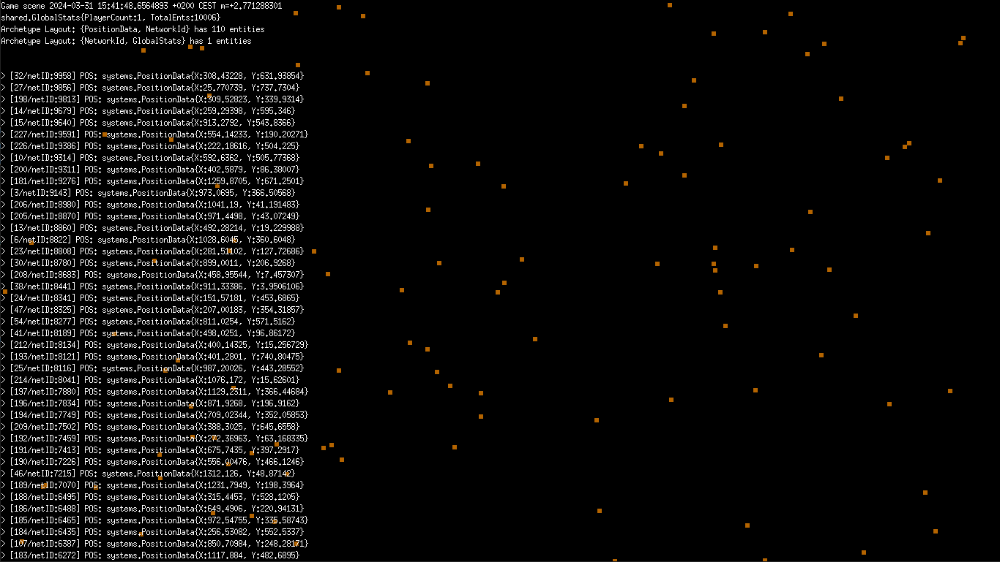

# necs-example

> This example shows how to setup a server, client and network entities between them.

# Demo
> Live demo is available at [example.leap.fish](https://example.leap.fish)

## About
This example is unfortunately not as well documented as we'd like, but it does show how to use NECS.